  

  
  

<pre>
 █████╗ ██████╗ ██╗████████╗██╗   ██╗ █████╗     ███████╗ ██████╗ ███╗   ██╗██╗
██╔══██╗██╔══██╗██║╚══██╔══╝╚██╗ ██╔╝██╔══██╗    ██╔════╝██╔═══██╗████╗  ██║██║
███████║██║  ██║██║   ██║    ╚████╔╝ ███████║    ███████╗██║   ██║██╔██╗ ██║██║
██╔══██║██║  ██║██║   ██║     ╚██╔╝  ██╔══██║    ╚════██║██║   ██║██║╚██╗██║██║
██║  ██║██████╔╝██║   ██║      ██║   ██║  ██║    ███████║╚██████╔╝██║ ╚████║██║
╚═╝  ╚═╝╚═════╝ ╚═╝   ╚═╝      ╚═╝   ╚═╝  ╚═╝    ╚══════╝ ╚═════╝ ╚═╝  ╚═══╝╚═╝
</pre>

---

## 💻 Professional Summary

Software Engineer with expertise in **Full-Stack Development** and a growing specialization in **AI**, **Data Science**, and **Generative AI**. **Experienced** in building scalable **web applications**, **AI-powered products**, and **LLM-integrated solutions** using **React**, **Next.js**, **Node.js**, **Python**, **TypeScript**, and modern AI frameworks. Strong foundation in **algorithms**, **databases**, and **backend engineering**, complemented by hands-on experience with **RAG**, **prompt engineering**, and **machine learning** workflows. Passionate about **solving real-world problems** through data-driven and **AI-powered applications** while continuously learning and contributing to modern software development.

---

## 🚀 About Me

I’m an **AI Engineer | LLM Engineer | Full-Stack Developer** focused on building **intelligent, scalable, and production-ready applications**.

My work sits at the intersection of **software engineering and AI systems**, where I design and build applications powered by **Large Language Models (LLMs), backend systems, and modern web technologies**.

I enjoy going beyond surface-level implementation — diving into **how systems actually work**, optimizing for **performance, scalability, and real-world usability**.

---

### 🧠 What I’m Currently Building & Exploring

- 🤖 **LLM Applications** (RAG, Agents, Prompt Engineering, AI APIs)
- ⚡ **High-Performance Backends** using Bun, Hono & Node.js
- 🗄️ **Database Design** with PostgreSQL, Redis & Drizzle ORM
- 🧩 **System Design & Scalable Architectures**
- ☁️ **Cloud & DevOps** (Docker, CI/CD, deployment pipelines)
- 📱 **Cross-Platform Apps** using React Native & Expo
- 🤖 **AI-Based Application** building real world AI based application
- 🧬 Exploring **Rust, Web3, Solana & Blockchain Systems**

---

## 🎯 Focus Areas

- AI Engineering & LLM-Based Systems
- Full-Stack Development (MERN + Modern Stack)
- Backend Performance & API Design
- Generative AI & Applied Machine Learning
- System Design & Scalable Architectures
- DevOps & Cloud-Native Development

---

## 📊 GitHub Contribution Stats

  

---

## 🛠️ Tech Stack

### 🧑‍💻 Programming Languages

  

### 🎨 Frontend

  

### ⚙️ Backend

  

## 🧠 AI / LLM Stack

  

  <b>Building Intelligent Systems with Modern AI Tools</b>

  🤖 LLM APIs (OpenAI, etc.) &nbsp; • &nbsp;
  🧠 Prompt Engineering &nbsp; • &nbsp;
  📚 RAG (Retrieval-Augmented Generation)  
  ⚙️ AI Agents & Workflows &nbsp; • &nbsp;
  🔍 Vector Search & Embeddings

### 🗄️ Database & Caching

  

### 🔐 Auth & Tooling

  

### 🚀 DevOps & Cloud

  

### 🧰 Tools

  

---

## 📈 Top Languages

  

---

## 🔗 Connect With Me

  
  
  

---

  

