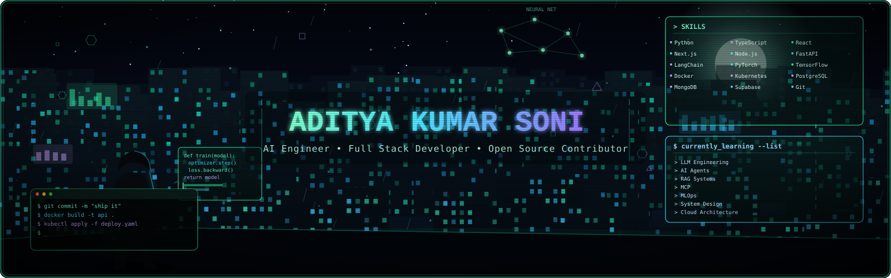
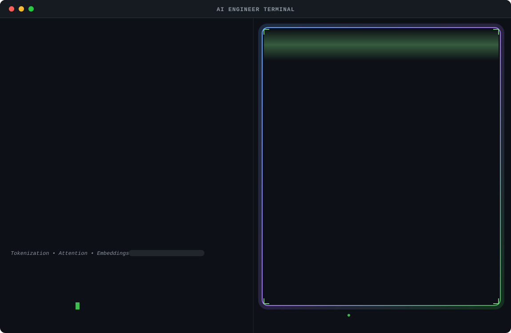

  

  
  

---

## 🚀 About Me

I'm an **AI Engineer | LLM Engineer | Full-Stack Developer** who builds intelligent, production-ready applications — not just notebooks and demos.

My work sits at the intersection of **software engineering and AI systems**: RAG pipelines, LLM-powered agents, and full-stack apps backed by scalable databases and clean architecture. I like going past the surface-level implementation to understand **how systems actually work under the hood**, optimizing for performance and real-world usability.

Currently exploring **Rust, Web3, Solana, and blockchain systems** on the side.

📄 **Open to:** AI/LLM Engineering & Full-Stack roles (Remote / Hybrid) — feel free to reach out below.

---

## 🧠 Currently Building & Exploring

- 🤖 **LLM Applications** — RAG pipelines, AI agents, prompt engineering
- ⚡ **High-Performance Backends** — Bun, Hono, Node.js
- 🗄️ **Database Design** — PostgreSQL, Redis, Drizzle ORM, Convex
- ☁️ **Cloud & DevOps** — Docker, CI/CD, deployment pipelines
- 📱 **Cross-Platform Apps** — React Native & Expo
- 🧬 **Exploring** — Rust, Web3, Solana & blockchain systems

---

## 🚀 Featured Projects

<table>
<tr>
<td width="50%">

### 📚 [Semantic Book Recommender](https://github.com/Adityaz23/books-recommendation)
Discover your next favorite book using AI-powered **semantic search**, emotional-tone filtering, and category-based recommendations. Query in plain English (e.g. *"a dark fantasy with complex world-building"*) and get ranked matches with cover art, previews, and buy links.

**Tech:** LangChain · ChromaDB · HuggingFace Embeddings · Gradio · Python

🔗 [Live Demo](https://huggingface.co/spaces/Adityaz23/book-recommendation)

</td>
<td width="50%">

### 🎥 [AI Video Assistant](https://github.com/Adityaz23/Video-Transcriber)
Turns any meeting video, YouTube link, or audio file into a clean transcript, AI summary, action items, key decisions — plus a **RAG-powered chat** interface to ask questions about the content. Supports English (local Whisper) and Hinglish (Sarvam AI).

**Tech:** Faster-Whisper · Groq (Llama 3.3) · LangChain · ChromaDB · Streamlit

🔗 [Live Demo](https://video-transcribe.streamlit.app/)

</td>
</tr>
<tr>
<td width="50%">

### ✍️ [Blog Intel](https://github.com/Adityaz23/Blog-intel)
A modern full-stack blogging platform with secure authentication and **real-time data updates**. Built on the Next.js App Router for a scalable, responsive experience with instant UI feedback.

**Tech:** Next.js 16 · Convex (real-time backend) · better-auth · TypeScript · Tailwind CSS

🔗 [Live Demo](https://blog-intel.vercel.app/)

</td>
<td width="50%">

### 💼 [JobSearch](https://github.com/Adityaz23/JobSearch) 
A job search platform in active development, built on Next.js with a Supabase-backed database layer for storing and querying listings.

**Tech:** Next.js · Supabase · TypeScript

</td>
</tr>
</table>

---

## 🛠️ Tech Stack

### 🧑‍💻 Programming Languages

  

### 🎨 Frontend

  

### ⚙️ Backend

  

### 🧠 AI / LLM Stack

  🤖 LLM APIs (Groq, OpenAI) &nbsp; • &nbsp;
  🧠 Prompt Engineering &nbsp; • &nbsp;
  📚 RAG (Retrieval-Augmented Generation)  
  ⚙️ LangChain &nbsp; • &nbsp;
  🔍 Vector Search & Embeddings (ChromaDB, HuggingFace)

### 🗄️ Database & Caching

  

### 🔐 Auth & Tooling

  

### 🚀 DevOps & Cloud

  

### 🧰 Tools

  

---

## 📊 GitHub Stats

  
  

  

---

## 🔗 Connect With Me

  
  
  

---

  

  

  <a href="#readme-top">⬆️ Back to top</a>

  

